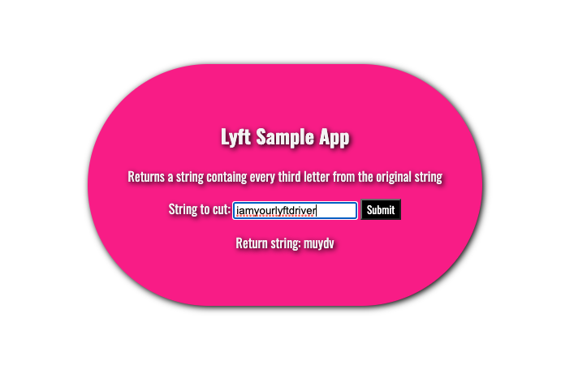

# lyft_sample_app
## Project description

This project is a small Node web application that does the following:
* Accepts a POST request to the route “/test”, which accepts one argument “string_to_cut”
* Returns a JSON object with the key “return_string” and a string containing every third letter from the original string
  * (e.g.) If you POST {"string_to_cut": "iamyourlyftdriver"}, it will return: {"return_string": "muydv"}.


## Installation and Environment Setup 

Make sure you have Node installed.

Once the repo is cloned and Node is installed
  * In terminal, go to your backend folder
  * run the command: ```npm install```
    * this will install all the necessary dependencies
  * run the command: ```npm run start```
    * This will run your server on port 2020 

  Enjoy the app! 


## Testing

 To see the expected behavior, you can run this command on your terminal once you have the server running:
 ```
  curl -X POST http://localhost:2020/test --data '{"string_to_cut": "iamyourlyftdriver"}' -H 'Content-Type: application/json'
 ```
 Expected output:

 ```
 {"return_string":"muydv"}
 ```

 You can alternitavely substitute the string in "string_to_cut" any string you would like!


 ### Option 2
 You can also open index.html, insert any string you would like, and press submit.


 
